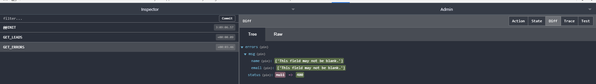

# Error Handling & Alerts

1. 모듈은 react 내부 alerts 를 이용한다.
1. api는 : https://github.com/schiehll/react-alert 참조

# 설치

1. > npm i react-alert react-alert-template-basic react-transition-group

# importing and options

1. App.js 에 import

```js
import { Provider as AlertProvier } from "react-alert";
import AlertTemplate from "react-alert-template-basic";
```

1. 옵션 설정

```js
const alertOptions = {
  timeout: 3000, // 3초
  position: "top center",
};
```

1. render 에 AlertProvider 추가 ( App.js 참조)

# Alert component 구현

1. src/components/layout 폴더에 Alerts.js 파일을 만들고 템플릿 소스를 생성 하자 ( rec + tab )
1. 기본 alerts를 구현하고 테스트 해봐야 한다.

```js
import React, { Component, Fragment } from "react";
import { withAlert } from "react-alert";

export class Alerts extends Component {
  componentDidMount() {
    this.props.alert.show("test");
  }

  render() {
    return <Fragment />;
  }
}

export default withAlert(Alerts);
```

1. 구현 된 alert 을 app.js에 반영 해 보자
   1. `import Alerts from "./lead/Alerts";`
   1. <Head /> 밑에 <Alerts /> 등록 후 테스트하면 나와야 되는데 안나옴
1. console 에 뭔가 오류가 나오고 있음
   1. Component ConnectFunction declared `PropTypes` instead of `propTypes`. Did you misspell the property assignment?
   1. 해당 오류는 PropTypes 라는 이름으로 import 받고 render 함수 안에서 PropTypes 변수명으로 type을 선언했기때문에 발상하는 오류로
   1. const PropTypes .... -> const propTypes 로 고치면 해결 된다
1. 새로운 오류가 발생
   1. Objects are not valid as a React child
   1. 이상한게 없는데 ㅡ,.ㅡ;
   1. withAlert(Alerts) -> withAlert()(Alerts) 로 변경하니까 됨

# reducer 추가

1. reducers 폴더에 errors.js 추가
1. application 이니까 index.js 에 export 추가 필수
1. type 추가
   1. actions 폴더에 types.js
   1. GET_ERRORS 추가
1. errors reducer 구현

```js
import { GET_ERRORS } from "../actions/types";

const initialState = {
  msg: {},
  status: null,
};

export default function (state = initialState, action) {
  switch (action.type) {
    case GET_ERRORS:
      return {
        msg: action.payload.msg,
        status: action.payload.status,
      };
    default:
      return state;
  }
}
```

# response error 처리

1. action axios 에 오류 처리
   1. `.catch((err) => console.log(err));`
   1. `.catch((err) => console.log(err.response.data));`
   1. 이렇게 변경하면 오류가 날 경우 크롬 console 에서 상세 정보 확인 가능
1. 위에 변경 내용은 그저 확인 용이고 실제로 데이터 전달을 위해 해당 코드는 변경 해준다.
   1. errors 라는 변수 ( 튜플 ) 를 생성하고 msg, status 데이터를 담는다.
   1. dispatch를 이용해 type 과 payload 정보를 오류가 날 경우 전송 한다.
1. source

```js
    .catch(err => {
        const errors = {
            msg: err.response.data,
            status: err.response.status
        };
        dispathc({
            type: GET_ERROR,
            payload: errors
        });
    });

```

1. 이건 오류 난다. dispathc 스펠링 틀림
1. 오류내역은 console 과 redux 페이지에서 확인 하자
1. redux 개발자 kit 에서 아래와 같이 디버깅 가능하다.
   

# alert component response 연결

1. alerts.js 에 connect, PropTypes import
   1. import { connect } from "react-redux";
   1. import PropTypes from "prop-types";
1. export 에 connect 연결
   1. export default connect(mapStateToProps)(withAlert()(Alerts));
1. mapStateToProps 로 props -> state 연결
   1. const mapStateToProps = (state) => ({
   1. error: state.errors,
   1. });
1. propTypes 정의
   1. static propTypes = { error: PropTypes.object.isRequired, };
1. components 에 mount 가 아닌 update event 로 변경
   1. 나중에 componentDidUpdate 에 인자로 넘어가는 object 에 값들 다 확인 해 봐야 함
   1. error 인자 유무에 따라 alert.error 발생처리

# create_message 처리 ( lead 데이터 생성, 삭제 시 사용)

1. type 추가 GET_MESSAGE, CREATE_MESSAGE
1. reducer 생성 MESSAGE.js
1. actions 폴더 message.js 생성
1. actions/leads.js 에 작업
   1. addLead axios 에 추가 : dispatch(createMessage({ leadAdd: 'Lead Addeds'}))
1. alert.js 에 mapStateToProps : state.messages 추가
   1. propsTypes 추가
   1. componentDidUpdate 에 message 추가
