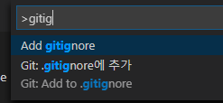
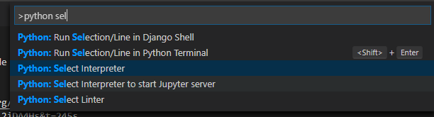

# react_django_admin
backend side : django , frontend side : react

# 참조 사이트
https://www.django-rest-framework.org/
https://www.youtube.com/watch?v=Uyei2iDA4Hs&t=245s

# git repository
https://github.com/andurogit/react_django_admin.git

# create .gitignore
1. vscode gitignore extension install
1. ctl + shift + p : enter the pattlet

* image paste with vscode ( Paste Image )
* hotkey : ctrl + alt + v

1. python select

# pipenv 설치
1. 파이선 가상 머신 생성을 위한 pipenv 설치
1. > pip3 install pipenv

# Pip file 생성
1. > pipevn shell

# package 설치
1. > pipenv install django djangorestframework django-rest-knox

# 장고 프로젝트 생성
1. > django-admin startproject "플젝명"
1. > django-admin startproject react_django_admin_backend

# 인터프리터 선택

1. ctrl + shift + p
1. python:Select interpreter
1. 가상환경 선택

# 폴더 이동 장고 폴더 및 앱생성

1. > python manage.py startapp leads
1. sample 로 생성 

# 기본 setting.py ( react_django_admin_backend 폴더 )

1. apps 추가
INSTALLED_APPS = [
    ...
    'leads',
    'rest_framework' # magrations 할 때 오류남
]

# sample 소스는 각기 소스에서 확인

# sam01. models 수정 ( leads 폴더)

class Lead(models.Model):
    name = models.CharField(max_length=100)
    email = models.EmailField(max_length=100, unique=True)
    message = models.CharField(max_length=500, blank=True)
    created_at = models.DateTimeField(auto_now_add=True)

# 마이그레이션

1. > python manage.py makemigrations leads
1. leads/migrations/0001_initial.py 생성 됨
1. python manage.py migrate # 전체 마이그레이션

# serializers.py 생성 lead 폴더

from rest_framework import serializers
from leads.models import Lead

class leadSerializer(serializers.ModelSerializer):
    class Meta:
        model = Lead
        field = '__all__'

# api.py 생성

from leads.models import Lead
form rest_framework import veiwsets. permissions
from .serializers import LeadSerializer

# viewSets
class LeadViewSet(viewsets.ModelViewSet):
    queryset = Lead.objects.all()
    permission_classes = [
        permissions.AllowAny
    ]
    seilal_class = lead시리얼

# urls.py ( 루트 폴더 )    

1. include import 추가
1. path('',include('leads.urls')),

# leads 폴더 urls.py 추가

from rest_framework import routers
from .api import LeadViewSet

router = routers.DefaultRouter()
router.register('api/leads', LeadViewSet, 'leads')

urlpatterns = router.urls

# error 

No module named 'rest_framework'

> python -m pip install --upgrade pip
> pip3 install djangorestframework

# 테스트는 포스트맨이라는걸 사용한다

1. 굳이 이걸 사용 안해도 기본 페이지에 입력 폼을 제공한다.

------------

https://www.youtube.com/watch?v=GieYIzvdt2U